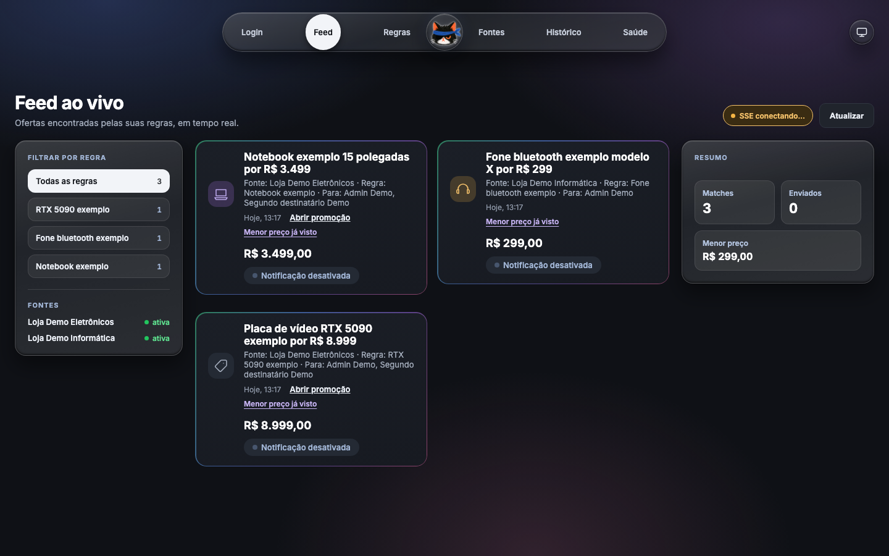
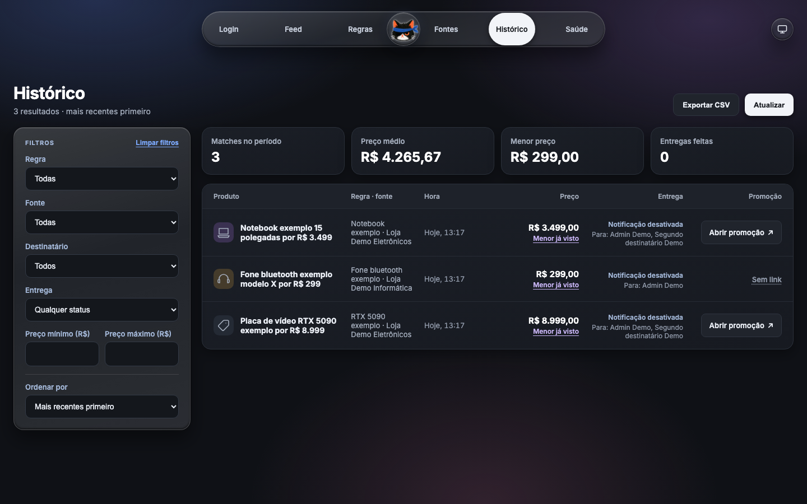
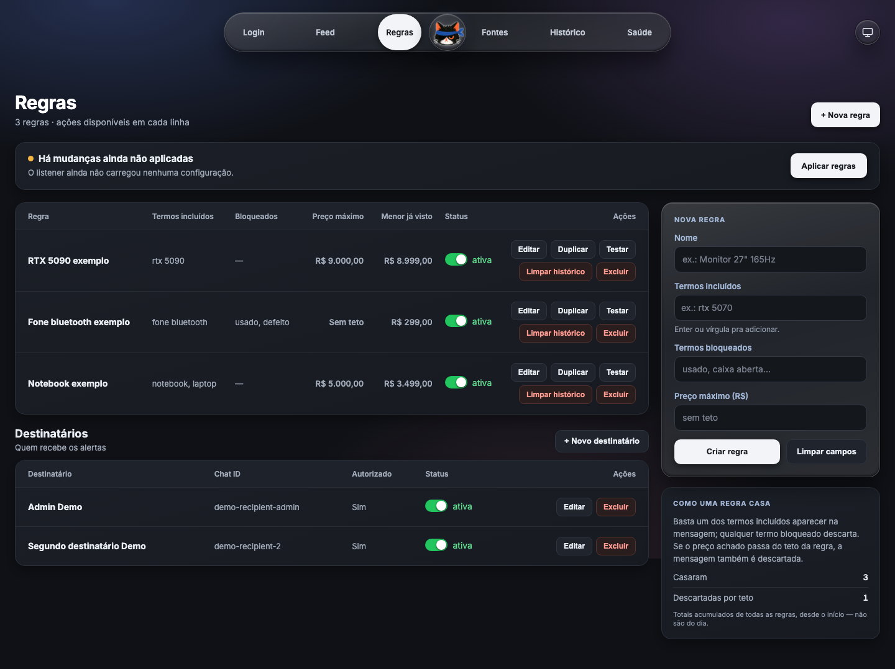
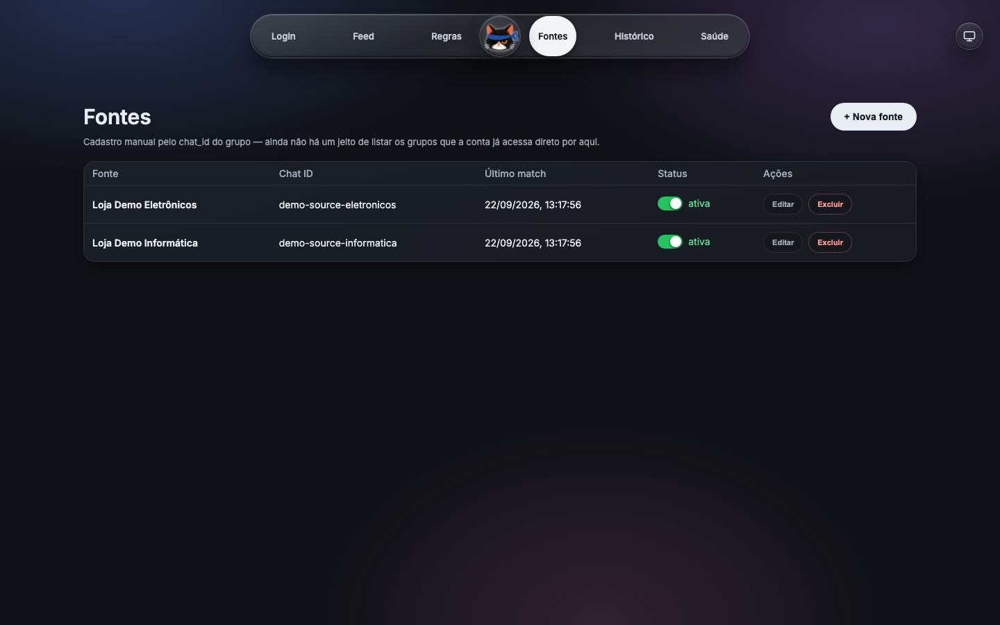
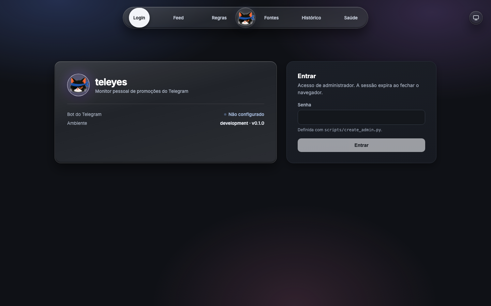
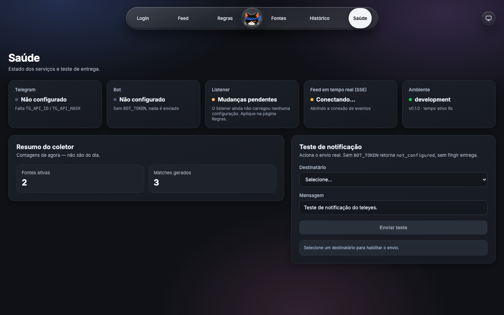

# teleyes

A personal Telegram promotion monitor: it watches groups you already belong to, filters messages against
rules you define, deduplicates matches and sends you a private alert in seconds — so you can mute noisy
promo groups without missing the one deal you actually care about.

Single-admin, self-hosted, v1. Built to run 24/7 on a home machine, with no cloud dependency beyond
Telegram itself.

## The problem

Promo/deal Telegram groups are useful but noisy — dozens of messages a day, most of them irrelevant. The
two usual options are both bad: mute the group and miss real deals, or leave notifications on and get
drowned out. teleyes reads the groups your account can already access, keeps only the messages that match
rules you wrote (keyword, price ceiling, exclusions), and pings you privately through its own Telegram bot
— nothing else changes about how you use Telegram.

## Screenshots

All screenshots below are generated from seeded **demonstration data** against an isolated test backend —
never a real deployment. Store names, prices and Telegram identifiers are fictional. The dashboard's UI
language is Portuguese (pt-BR) by product decision — this is a personal tool, not a public product.

| Feed | History |
|---|---|
|  |  |

| Rules | Sources |
|---|---|
|  |  |

| Login | Health |
|---|---|
|  |  |

## Architecture

```text
Telegram (MTProto) → normalization → rules → deduplication → SQLite → SSE (live feed)
                                                            └→ Bot API → recipients
```

- A **Telethon/MTProto user session** reads messages from groups the account already has access to. It is
  read-only: it never replies, reacts, joins groups or forwards anything.
- Every active **rule** (include/exclude terms, optional price ceiling, source scope) is evaluated against
  every message from an active source.
- A **deduplication** pass compares normalized text, links, product and price inside the rule's window, so
  the same promotion reposted across groups doesn't produce repeat alerts.
- A match is persisted to **SQLite** and published to the dashboard over **SSE** in real time.
- A separate **bot** (its own BotFather token, decoupled from the reading session) sends the private alert
  and records delivery status back on the match.
- Rejected messages are **never persisted** — only aggregate counters and reasons.

## Stack

- **Backend**: Python, FastAPI, Telethon, SQLAlchemy 2 + Alembic, SQLite (WAL mode)
- **Frontend**: React, Vite, TypeScript, Server-Sent Events for the live feed
- **Ops**: Docker Compose (`api`, `listener`, `backup`, `web`), Tailscale Serve for private remote access
- **Tests**: pytest, Ruff, mypy for the backend; Vitest and Playwright for the frontend

## Notable technical decisions

- **Single process + SQLite, on purpose.** No Redis, Postgres, Kafka or microservices — the whole system
  is one admin's personal deployment on a home desktop. WAL mode gives it enough concurrency for one
  reader process and one API process to share the database safely, and a `VACUUM INTO` backup job runs
  without blocking either.
- **SSE instead of polling.** The dashboard needs a live feed, not a request loop; a single long-lived
  connection per client is enough at this scale and reconnects automatically on drop.
- **Deduplication as a first-class step**, not an afterthought — the same deal reposted across multiple
  monitored groups is recognized and merged before it reaches the feed or the notifier, and the same
  product/price combination is only ever alerted once per rule window, even across a listener restart
  (idempotent by design).
- **Conservative, explainable price extraction.** Starts with deterministic parsing (case/accent
  normalization, explicit currency patterns) instead of fuzzy/regex heuristics; fuzzy matching only gets
  added once real false positives justify it.
- **Honest "not configured" states, never mocked ones.** Without Telegram or bot credentials, the backend
  comes up normally but reports `not_configured` everywhere it's true (see the Health screenshot above) —
  nothing pretends to be connected. The same demo data used for these screenshots is produced by a
  `/demo/messages` endpoint built for exactly this: exercising the full pipeline (rules → dedup → SQLite →
  SSE) without a live Telegram session.
- **Allowlist enforced by the notifier, not just documented policy.** A recipient must be explicitly
  marked `allowlisted` (only done once they've started a conversation with the bot) or delivery is refused
  — the bot never initiates a conversation with anyone.

## Getting started (Docker Compose)

```bash
git clone <repository-url> teleyes
cd teleyes
cp .env.example .env
# Fill in TG_API_ID / TG_API_HASH (https://my.telegram.org/apps) and BOT_TOKEN
# (from @BotFather) in .env. Without them the app still runs — it just stays
# honestly "not configured" instead of faking a connection.

docker compose -f docker-compose.prod.yml build
docker compose -f docker-compose.prod.yml up -d --wait api   # runs migrations, waits for health
docker compose -f docker-compose.prod.yml run --rm --entrypoint python api scripts/telegram_login.py
docker compose -f docker-compose.prod.yml run --rm --entrypoint python api scripts/create_admin.py
docker compose -f docker-compose.prod.yml up -d              # starts listener, backup, web
```

The dashboard is then available at `http://localhost:8080`: register a source group and a recipient, write
a rule, and click **Aplicar regras** ("Apply rules") to have the listener pick it up without restarting.

For the full installation walkthrough, day-to-day operation, diagnostics, backup/restore, updates and
Windows boot automation, see **[`docs/OPERATIONS.md`](docs/OPERATIONS.md)**.

### Running the test suite

```bash
# Backend (requires Python 3.12+)
python3.12 -m venv .venv && .venv/bin/pip install -e ".[dev]"
source .venv/bin/activate
pytest
ruff check .
mypy .

# Frontend
cd apps/web
npm ci
npm run test          # Vitest
npm run test:e2e      # Playwright — spins up an isolated test backend + Vite dev server
```

## Out of scope for v1

- Multi-tenant / multi-admin use — this is a single-administrator tool.
- WhatsApp or any channel other than Telegram.
- Automatic replies, reactions or mass-forwarding in monitored groups.
- Public exposure — remote access is private, through Tailscale Serve only.
- Fuzzy/ML-based price or product matching — extraction starts deterministic and stays that way until
  real examples justify more.

## Further reading

- [`PRODUCT.md`](PRODUCT.md) — product definition, users, accessibility commitments.
- [`docs/PROJECT_SPEC.md`](docs/PROJECT_SPEC.md) — full technical specification.
- [`DESIGN.md`](DESIGN.md) — the implemented UI, design tokens and theming.
- [`docs/OPERATIONS.md`](docs/OPERATIONS.md) — operations runbook (in Portuguese).
