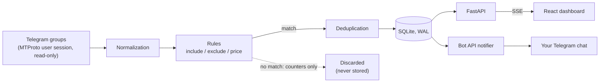

# teleyes

**A self-hosted Telegram deal monitor: it watches the promo groups you already read, keeps only what matches your rules, and pings you privately when a price hits your target.**

[](https://github.com/GabrielLimaSC/teleyes/actions/workflows/ci.yml)
[](LICENSE)


<!-- TODO(author): add promo video link -->

> The GIF is recorded from the [demo stack](#try-the-demo-in-one-command): every store, product, price and
> group in it is fictional. The dashboard is in Brazilian Portuguese (see [Features](#features)).

## Live demo

**[gabriellimasc.github.io/teleyes](https://gabriellimasc.github.io/teleyes/)** — the real dashboard in your
browser, no install. It is a static build with no backend: every store, product, price and group is
fictional, the dates are shifted so the data always looks fresh, a made-up offer shows up in the live feed
now and then, and every write is refused with a clear message (nothing is saved). The code that generates it
is `scripts/export_demo_fixtures.py` (data) and `apps/web/src/demo-static/` (the in-browser mock).

## Try the demo in one command

The full stack (real API, real pipeline, still 100% fictional data) on your machine. You only need Docker. No Telegram account, no bot, no secrets, no `.env`.

```bash
git clone https://github.com/GabrielLimaSC/teleyes.git
cd teleyes
docker compose -f docker-compose.demo.yml up --build
```

Open **http://localhost:18080** and sign in with the password `demo-teleyes` (it is also shown on the login
page).

- Everything is fictional: invented stores and groups, products named "... Exemplo", `example.com` links.
  A seeded script (`scripts/seed_demo.py`) builds a 90-day history through the real pipeline, so charts,
  sparklines, target pins and delivery states are populated whenever you start it.
- It is **read-only** by default: every write is refused with a clear message. A fictional offer arrives
  every 20-40 seconds so the live feed moves. To play with it, set `TELEYES_DEMO_READONLY=0`; to stop the
  incoming offers, `TELEYES_DEMO_LIVE=0`; to change the port, `TELEYES_DEMO_PORT=...`.
- There is no listener and no Telegram connection; the notifier is a no-op that never opens a network
  socket. The database lives in memory (tmpfs) and `docker compose -f docker-compose.demo.yml down` throws
  everything away.
- Demo mode refuses to start on a database with real data, and a demo database refuses to start in normal
  mode, so the public demo password can only exist next to fictional data.

## Why it exists

Telegram promo groups are full of good prices and a lot of noise: dozens of messages a day, most of them
irrelevant. Muting a group means missing the deal; leaving notifications on means drowning in them. teleyes
was built to save money while buying PC parts: it reads the groups an account can already see, keeps only
the messages that match rules written by the user, and sends a private alert through its own bot. The
matching is deliberately deterministic and explainable (plain terms, a price extractor, exact comparisons),
not an AI model guessing what a good deal is.

It is a personal, single-admin, self-hosted tool. It is not a hosted service (see
[Engineering decisions](#engineering-decisions) for why).

## How it works


```mermaid
flowchart LR
    TG["Telegram groups<br/>(MTProto user session, read-only)"] --> N[Normalization]
    N --> R["Rules<br/>include / exclude / price"]
    R -->|match| D["Deduplication"]
    R -.->|"no match: counters only"| X["Discarded<br/>(never stored)"]
    D --> DB[("SQLite, WAL")]
    DB --> API["FastAPI"]
    API -->|SSE| UI["React dashboard"]
    DB --> BOT["Bot API notifier"]
    BOT --> ME["Your Telegram chat"]
```

Two processes share one SQLite file: the **listener** (Telethon session, rules, dedup, alerts) and the
**api** (REST plus SSE for the dashboard). Docker Compose also runs a **backup** sidecar and an nginx
**web** container.

- **Rules.** A rule has include terms and optional exclude terms, compared after case and accent
  normalization. Include terms are alternatives (OR); a term written `memoria ram + 16gb` needs every part
  (AND, any order); any exclude term vetoes the match. A rule can also set a price ceiling and a price
  **target** ("alert me below"): a match at or below the target is a target hit.
- **Price extraction.** Conservative and deterministic: Brazilian formats such as `R$ 3.899,90`, `3899,90`
  or `6,991`, plus installment text. No fuzzy or ML matching.
- **Deduplication.** A signature over rule, source, normalized text, price and normalized link, so the same
  promotion reposted with different casing, tracking parameters or punctuation is recognized once. The feed
  can also group the same product and price seen in several groups.
- **Price history.** Each match is tied to a product key, which feeds the per-rule sparklines and the
  per-product price chart (lowest, average and highest over the window).
- **Delivery.** Alerts go through a separate Bot API token to recipients who were explicitly allowlisted
  after they started a chat with the bot. The bot never starts conversations.

## Features

- Live feed over SSE, with price-target cards pinned and "Apply rules" that reloads the listener without a
  restart.
- Rules with include/exclude terms, price ceiling and price target, plus a rule tester.
- Match history with filters and CSV export.
- Per-rule sparklines and a per-product price chart.
- Snooze for a product, and an optional daily digest instead of immediate alerts (target hits still alert
  immediately).
- Savings report: register what you actually bought and see an honest estimate against the prices the app itself saw
  (median of the 90 days before the purchase, "no data" when history is thin), plus a shareable results card
  (PNG + aggregates JSON) that never includes group names, messages or links.
- Retry of failed alert deliveries (recent failures are resent, never duplicated).
- Health page: listener, notifier and database state, reporting `not_configured` honestly when credentials
  are missing.
- Automatic SQLite backups, with a documented restore.
- Dark and light themes.
- Dashboard UI in Brazilian Portuguese (pt-BR). That is the current version's language, not a hard limit:
  translations (i18n) are welcome as a contribution.

## Engineering decisions

- **SQLite in WAL mode, on purpose.** One admin and a handful of writes per minute do not need Postgres or
  Redis. WAL plus `busy_timeout` lets the listener and the API share the file, and critical writes retry on
  a locked database. Backups use `VACUUM INTO`.
- **No write transaction across the network.** The alert pipeline commits its short write phase first, then
  talks to the Bot API, then writes the outcome in a second short transaction. Holding SQLite's single write
  lock across a slow network call made other writers wait and could deadlock the event loop; the comments in
  `apps/api/app/pipeline.py` and `apps/api/app/delivery_retry.py` document the fix.
- **SSE instead of polling.** The dashboard needs a one-way live stream; a single long-lived connection per
  client reconnects automatically and resumes by event id.
- **Idempotent alerts.** Dedup signatures live in the database and a delivery row is flipped only once, so a
  restart does not repeat a notification.
- **Privacy by construction.** Rejected messages are never stored, only aggregate counters and reasons.
  Matches keep the text they need, the price, the rule, the recipient, the delivery status and the original
  link.
- **Not a multi-tenant SaaS, by design.** An MTProto user session is equivalent to a full login to the
  Telegram account. Hosting other people's sessions would be an unacceptable risk, so teleyes is
  self-hosted: you run it, on your own machine, with your own account.
- **Honest states.** Without credentials the app still starts and reports `not_configured`; nothing pretends
  to be connected.

## Quick start (self-hosting)

Prerequisites: Docker with Compose, Telegram API credentials (`TG_API_ID` and `TG_API_HASH`, created at
<https://my.telegram.org/apps>, preferably for a dedicated account), and a bot token from
[@BotFather](https://t.me/BotFather).

```bash
git clone https://github.com/GabrielLimaSC/teleyes.git
cd teleyes
cp .env.example .env     # then fill in TG_API_ID, TG_API_HASH and BOT_TOKEN

docker compose -f docker-compose.prod.yml build
docker compose -f docker-compose.prod.yml up -d --wait api   # runs migrations, waits for health
docker compose -f docker-compose.prod.yml run --rm --entrypoint python api scripts/telegram_login.py
docker compose -f docker-compose.prod.yml run --rm --entrypoint python api scripts/create_admin.py
docker compose -f docker-compose.prod.yml up -d              # starts listener, backup and web
```

The dashboard is then at `http://localhost:8080` (published on localhost only). Register a source group
and a recipient, write a rule, and click **Aplicar regras**.

Environment variables (see [`.env.example`](.env.example)): `TG_API_ID`, `TG_API_HASH`, `BOT_TOKEN`,
`APP_ENV`, `DISPLAY_TIMEZONE` (default `America/Sao_Paulo`), and optionally `HEARTBEAT_URL` /
`HEARTBEAT_INTERVAL_SECONDS` for an external uptime monitor.

The full walkthrough (daily operation, diagnostics, backup and restore, updates, Windows boot automation) is
in [`docs/OPERATIONS.md`](docs/OPERATIONS.md), written in Portuguese. A guided first-run wizard to replace
the manual steps above is on the [roadmap](#roadmap).

## Security

- Remote access is meant to go through Tailscale Serve (private HTTPS); the app is not designed to be
  exposed to the public internet.
- Dashboard login uses an Argon2 password hash and a server-side session in an HttpOnly, Secure,
  SameSite cookie. Configuration endpoints never return a secret in full.
- The Telegram session file, API hash and bot token must never reach Git, logs, screenshots or issues.
- The Telegram client is read-only: it never replies, reacts, joins groups or forwards messages.

Details and how to report a vulnerability privately: [SECURITY.md](SECURITY.md).

## Tests and quality

Numbers from a run on 2026-10-21 against a fresh install:

| Check | Result |
|---|---|
| `pytest` | 804 tests passed |
| `ruff check .` | clean |
| `mypy .` | clean (170 source files) |
| `npm run test` (Vitest) | 607 tests passed |
| `npx tsc -b` | clean |
| `npm run lint` (Oxlint) | runs; a few existing React warnings, no errors |
| Playwright (`npm run test:e2e`) | 139 tests in 29 files; run locally against a real backend, not in CI yet |

GitHub Actions runs ruff, mypy, pytest, tsc, Oxlint and Vitest on every push and pull request to `dev` and
`main` ([workflow](.github/workflows/ci.yml)).

```bash
# Backend (Python 3.12+)
python3.12 -m venv .venv && .venv/bin/pip install -e ".[dev]"
.venv/bin/pytest && .venv/bin/ruff check . && .venv/bin/mypy .

# Frontend
cd apps/web && npm ci && npm run test && npx tsc -b && npm run lint
```

## Tech stack

- **Backend:** Python 3.12, FastAPI, Telethon (MTProto), SQLAlchemy 2, Alembic, SQLite (WAL), Argon2.
- **Frontend:** React, Vite, TypeScript, Server-Sent Events.
- **Ops:** Docker Compose (`api`, `listener`, `backup`, `web`), nginx, Tailscale Serve for private access.
- **Quality:** pytest, Ruff, mypy, Vitest, Oxlint, Playwright, GitHub Actions.

## Roadmap

Honest and undated:

- A guided first-run wizard (credentials, Telegram login, first rule) in the dashboard.
- Polish for a one-command self-hosted install.
- A savings report built from price history.

Out of scope for now: multi-tenant use, channels other than Telegram, automatic replies or reactions in
groups, public exposure, and fuzzy or ML matching.

## Contributing and license

Contributions are welcome; read [CONTRIBUTING.md](CONTRIBUTING.md) first and open an issue before anything
large. More context: [PRODUCT.md](PRODUCT.md), [DESIGN.md](DESIGN.md), [docs/PROJECT_SPEC.md](docs/PROJECT_SPEC.md).

Released under the [MIT License](LICENSE).
